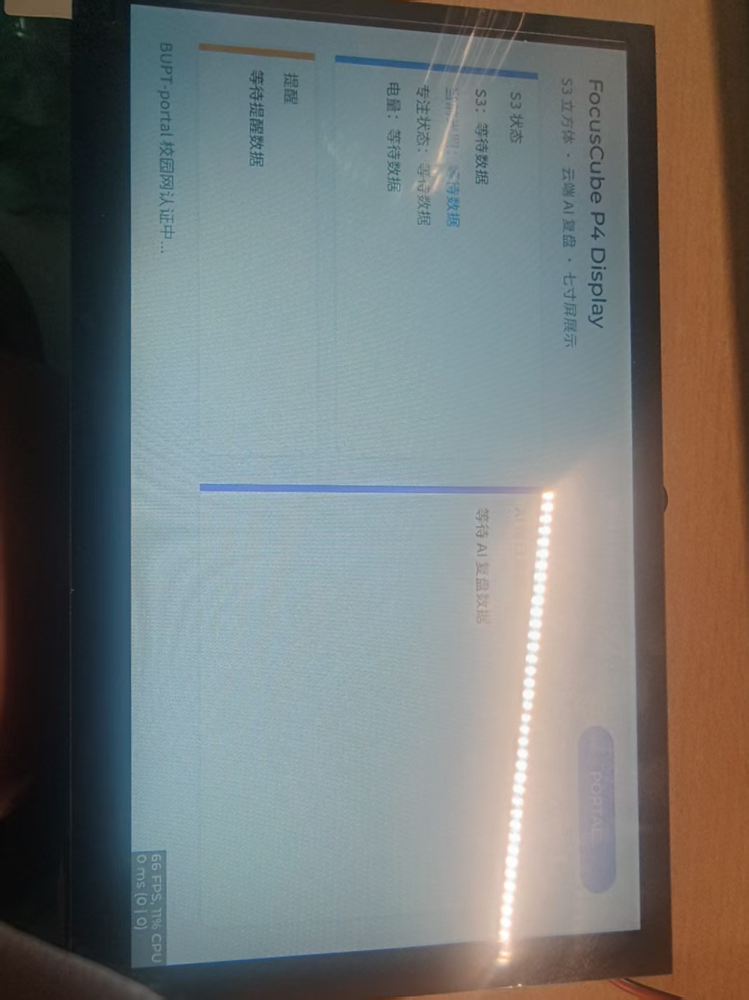

# 2026-07-14 联调状态

## 后端接口

联调基础地址：`http://10.129.90.92:8000`

> 该地址是当前局域网动态地址，仅用于现场联调。最终固件应通过集中配置修改，不能散落硬编码。

已实际验证以下接口均返回 HTTP 200 和合法 UTF-8 JSON：

```text
POST /api/v1/telemetry
GET  /api/v1/status
GET  /api/v1/report/daily?device_id=focuscube-s3-01&date=2026-07-14
GET  /api/v1/reminders?device_id=focuscube-s3-01&since=0
GET  /api/v1/timeseries?device_id=focuscube-s3-01&date=2026-07-14&metric=light.lux
```

已验证内容包括设备状态、中文日报、统计指标、建议、低电量提醒、光线偏暗提醒和光照时序数据。

## AS7341 真实光照闭环

AS7341 代理已通过 `POST /api/v1/telemetry` 持续上报真实光照，后端返回 HTTP 201、`stored: true`。三档实测结果如下：

代理统一设备身份：

```text
device_id=focuscube-c3-proxy-01
source=c3-as7341-proxy
```

早期使用 `focuscube-s3-01` 的代理数据属于联调历史数据；后续不得继续混用，真实 S3 到位后单独使用 `focuscube-s3-01`。

| 实测照度 | 设备标签 | 后端阈值判定 |
|---:|---|---|
| `100.56 lux` | `too_dim` | 一致 |
| `360.72 lux` | `suitable` | 一致 |
| `4013.64 lux` | `too_bright` | 一致 |

三次采样均由 A 确认 `saturated: false`。`/status` 最新值已更新为 `4013.64 lux`，时序、提醒和日报验收无异常。

光照值是 AS7341 换算得到的估算照度，当前尚未经过标准照度计标定；材料中应表述为“估算照度”，不得声明为计量级照度。

## 可选 `valid` 规则

- `imu.valid`、`focus.valid`、`power.valid` 可选，缺省为 `true`。
- AS7341 代理当前只提供真实光照，其余占位模块显式发送 `valid: false`。
- 后端不得使用 `valid: false` 数据生成统计、提醒、日报或融合结论。
- 真实 IMU、电量和专注数据接入后改为 `valid: true`，或省略该字段。
- 当前没有 S3 实物，IMU 硬件测试延期至设备到位后进行。

## P4 七寸屏

- 工程原位置：`/Users/buptniaosuan/Desktop/物联网/ESP32-P4-WIFI6-Touch-LCD-7B-main/examples/ESP-IDF/10_lvgl_demo_v9`
- 工程启动说明：原工程内 `P4工程启动说明.md`
- 固定中文和标题乱码已经修复，现场确认无乱码。
- P4 此前已成功访问 `/api/v1/status` 并显示真实 JSON。
- P4 具备请求失败后自动重试能力，后端恢复后无需重启设备。
- P4 工程尚未同步到共享仓库，目标目录为 `firmware/esp32-p4/`。

阶段性屏幕照片：



## 已解决问题

- 此前 `10.129.90.92:8000` 出现 TCP 可连接但 HTTP 持续超时；当前接口和 AS7341 实际上报已经恢复并完成验证。

## 已知数据问题

- 早期 mock 时序中存在多条相同 `ts`，后续 S3 或 replay 必须使用递增的真实时间戳。
- 日报生成后新增的 `60 lux` 数据没有进入已缓存日报；演示前必须触发重新生成，确认 `min_lux`、`avg_lux` 和 `suitable_light_ratio` 更新。
- 当前没有可用 S3 主固件；真实光照由 AS7341 代理提供，真实 IMU、专注和电量仍待补齐。

## 下一次验收

- 让 P4/Web 正确处理 `valid: false`，显示“等待真实数据”而不是占位数值。
- P4 展示真实状态、AI 复盘和提醒，连续刷新且断网不崩溃。
- 成员 B 上传 P4 工程、依赖说明、烧录步骤和完整屏幕照片。
- 成员 C 上传后端工程、模型调用说明、配置模板和失败兜底说明。
