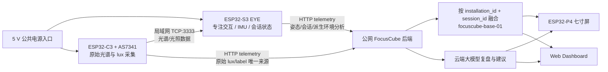

# FocusCube 提交材料总控与事实基线

> 版本：2026-07-23 草案 v1
> 用途：统一设计方案、答辩稿、演示视频、报名表和宣传材料中的架构、数据与完成度表述。
> 维护规则：后续材料与本文件冲突时，以本文件最新版本和对应测试证据为准。

## 1. 项目统一名称与一句话定义

建议项目名称：

**FocusCube：基于双节点边缘感知与云端大模型的智能专注环境系统**

一句话定义：

> FocusCube 面向校园学习与办公场景，通过 ESP32-S3 EYE 与 ESP32-C3/AS7341 双节点协同采集姿态、专注会话和光环境信息，在端侧完成状态判断与环境派生分析，在云端完成结构化存储、融合、提醒和大模型复盘，并由 ESP32-P4 七寸屏与 Web 页面展示。

不得再把项目描述成“单个 S3 立方体采集所有数据”。C3 是独立物理节点和原始光照唯一云端上传者；EYE 是专注交互与派生环境分析节点。

## 2. 最新系统架构

数据责任必须保持以下边界：

| 数据 | 唯一原始来源 | 其他节点允许上传的内容 |
|---|---|---|
| AS7341 原始通道、lux、光照标签 | C3 | EYE 不重复上传原始光照；只能上传带来源和质量标记的派生环境结论 |
| 六面姿态、活动度 | EYE | 后端只接收和展示，不伪造 |
| 专注会话状态、剩余时间、次数 | EYE | 后端融合和统计 |
| 大模型日报、建议 | 后端 | P4/Web 只展示 |
| 融合视图 | 后端 | P4/Web 使用逻辑设备 `focuscube-base-01` |

## 3. 完成度标记规则

所有提交材料必须使用以下四类状态，不允许把目标设计写成既成事实。

| 标记 | 含义 | 可使用的表述 |
|---|---|---|
| `实机验证` | 真实硬件或真实公网请求已有可复核证据 | “已实机验证”“实测通过” |
| `代码完成` | 代码和自动化测试存在，但尚未完成最终实机联调 | “已实现，待实机联调” |
| `接口对齐中` | 架构已确定，当前被 schema、部署或跨节点联调阻塞 | “目标接口已确定，正在对齐” |
| `规划项` | 尚未实现或尚未形成可复核证据 | “计划”“可扩展”，不得写“已实现” |

## 4. 截至 2026-07-23 的事实状态

| 子系统 | 当前状态 | 已有证据 | 提交材料中的准确写法 |
|---|---|---|---|
| EYE 本地功能 | 实机验证 | 本地 Dashboard、六面 IMU、模式切换、SD、相机、麦克风、CSI、复位恢复、稳定性记录 | EYE 基础硬件与本地交互已经通过实机验收 |
| EYE 公网 POST | 实机验证但 payload 失败 | Apache/FastAPI 日志记录公网路径正确、约每 30 秒请求一次、HTTP 422 | 已证明公网链路可达；遥测 schema 正在对齐，不能写成“云端上传成功” |
| EYE 派生环境分析 | 接口对齐中 | 目标架构和接口文档已建立 | C3 数据经 TCP 提供给 EYE，EYE 负责派生判断；最终联调证据待补 |
| C3 + AS7341 采光 | 实机验证过旧链路；新直传代码完成 | 真实 AS7341 数据、三档阈值样本；C3 v2 代码与回归测试 | 传感器采集和阈值判断已有实测；新多节点直传待后端 v2 联调 |
| C3 TCP:3333 | 代码完成/待联合实机 | C3 实施指南、探针和测试 | 已实现通信方案，最终 EYE+C3 联合实机证据待补 |
| 后端 v1 | 实机/公网验证 | status、report、reminders、timeseries、config 和既有 pytest | 既有单节点 API 和公网部署可用 |
| 后端多节点 v2 | 接口对齐中 | 总规范、v2 示例和后端实施文档 | 兼容缺失数据、质量标记和融合视图正在实现 |
| 云端大模型复盘 | 实际调用验证 | 2026-07-19 AI Gateway 成功记录 | 云端大模型日报已完成真实调用验证 |
| P4 七寸屏 | 实机验证 | status/report/reminders HTTP 200、中文显示和滚动提醒修复记录 | P4 已能展示真实后端数据；融合逻辑设备视图待 v2 接口 |
| Web Dashboard | 已部署；融合页待 v2 | 公网 Dashboard 地址和现有 API 展示 | 现有 Dashboard 可用；最终融合视图待多节点接口 |
| TinyML | 规划项 | 尚无模型、数据集、评测结果和固件证据 | 不作为当前已完成能力；只列为后续扩展 |

## 5. 对赛题必备项的映射

| 赛题要求 | FocusCube 对应设计 | 当前证据状态 |
|---|---|---|
| 核心主控采用指定 ESP32 芯片 | ESP32-S3 EYE；显示端采用 ESP32-P4，采光节点采用 ESP32-C3 | 硬件已存在并完成分模块实测 |
| 至少一种传感器数据融合 | AS7341 光环境 + EYE QMA6100P 姿态/活动度 + 专注会话状态 | 分模块已测，云端融合接口对齐中 |
| 至少接入一种云端大模型 | 云端 AI Gateway 生成日报与建议 | 已真实调用验证 |
| 设备上传非音视频感知数据供模型处理，或响应模型下行 | 上传结构化光环境、姿态和会话数据；P4/Web 展示报告与提醒 | v1 链路已验证，v2 融合待联调 |
| 可体现边缘 AI/智能处理 | 端侧阈值、自适应质量判断、姿态与状态机、EYE 派生环境分析 | 规则算法可作为已实现/实施中能力；TinyML 不作完成声明 |

## 6. 本次提交材料包

| 文件 | 用途 | 负责人建议 |
|---|---|---|
| `00_提交材料总控与事实基线_2026-07-23.md` | 所有文案的事实源与进度总控 | A 维护，B/C/D 复核 |
| `01_FocusCube完整设计方案重构稿_2026-07-23.md` | 按官方模板排版前的完整正文 | A 总审，B/C/D 补各自章节 |
| `02_实物演示视频脚本_2026-07-23.md` | 1–5 分钟内部目标版本的分镜、台词和取证要求 | D 剪辑，A 主讲，B/C 录屏 |
| `03_队伍信息表与分工说明_2026-07-23.md` | 报名系统、封面、答辩和贡献说明 | A 收集真实身份信息 |
| `04_提交前证据与素材清单_2026-07-23.md` | 照片、日志、录屏、测试记录的收集与命名 | 全员 |
| `05_答辩PPT结构与问答库_2026-07-23.md` | PPT 叙事、时间分配和评委问答准备 | A 主讲，全员按模块答问 |

说明：赛事文件要求按组委会发布模板提交完整设计方案和实物演示视频。当前仓库未发现最终报名系统模板，正式排版和视频格式必须在上传前以报名网站/组委会最新模板为准。项目内部暂按 **1–5 分钟**准备视频。

## 7. 禁止出现的失实或过时表述

1. “EYE 直接采集 AS7341 原始数据并上传云端”——错误，原始光照由 C3 唯一上传。
2. “EYE 已成功向新 schema 上传 telemetry”——目前仅证明公网可达，响应仍为 422。
3. “后端已经完成 `focuscube-base-01` 融合”——当前仍在接口对齐。
4. “已经部署 TinyML 模型”——没有模型、数据集、指标和固件证据。
5. “光照值达到专业照度计精度”——当前 lux 仍需校准，只能表述为 AS7341 派生照度/相对环境指标。
6. “摄像头或麦克风数据上传云端参与分析”——当前架构只上传结构化非音视频 telemetry。
7. “项目所有功能全部完成”——必须按第 4 节拆分状态。
8. 使用旧局域网后端地址作为最终地址——公网入口为 `http://82.156.238.244/focuscube/`，最终文档仍应尽量用可配置 URL，不把地址写死为系统特性。

## 8. 材料冻结节奏

| 日期 | 目标 |
|---|---|
| 7 月 23 日 | 冻结架构叙事、队伍信息表、方案目录和视频分镜 |
| 7 月 24 日 | 完成 schema 对齐和 EYE/C3/后端分支联调，更新事实状态 |
| 7 月 25 日 | 完成端到端彩排，集中拍摄实物和屏幕素材 |
| 7 月 26 日 | 完成设计方案排版、视频剪辑、字幕、证据复核和上传预检 |
| 7 月 27 日 | 预留上传与平台异常缓冲，截止前完成正式提交 |

不得把 7 月 27 日作为首次上传时间。

## 9. 最终材料进入“可提交”状态的门槛

- [ ] 组委会最新设计方案模板、视频格式、文件大小和报名字段已再次核对。
- [ ] C3 向公网后端上传一次真实 telemetry，获得 HTTP 200/201。
- [ ] EYE 向公网后端上传一次符合新 schema 的 telemetry，获得 HTTP 200/201。
- [ ] EYE 从 C3 TCP:3333 接收真实数据并生成一次派生环境结论。
- [ ] 后端能查询 C3、EYE 两个物理节点和 `focuscube-base-01` 融合视图。
- [ ] P4/Web 至少一个终端展示融合状态、日报或提醒；另一个终端完成基础展示。
- [ ] 视频中的每个“已实现”镜头都有原始录像或日志支撑。
- [ ] 队伍名称、学校、成员、学号、联系方式和指导教师信息已由本人核对。
- [ ] 所有第三方库、模型服务、图标和素材已列明来源。
- [ ] 设计方案、视频、代码仓库中的设备 ID、接口名称、阈值和架构一致。
