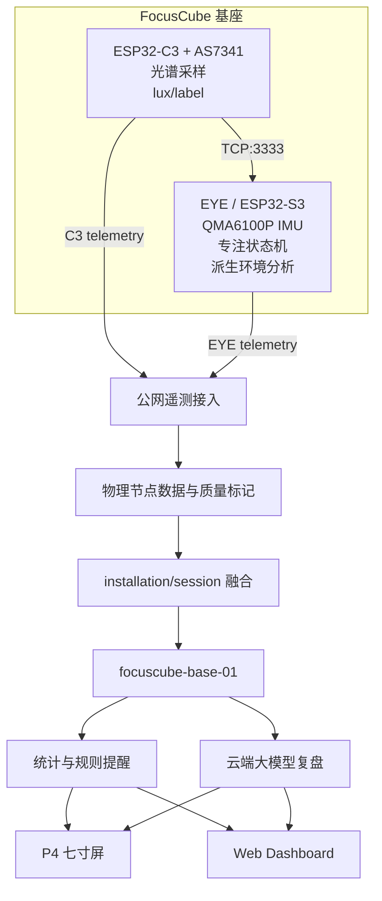

# FocusCube：基于双节点边缘感知与云端大模型的智能专注环境系统

> 完整设计方案重构稿，版本：2026-07-23 v1
> 本文是内容母稿，不替代组委会最终格式模板。正式提交前须完成身份信息、实测数据、图片编号和接口联调结果的回填。

## 封面信息

| 项目 | 内容 |
|---|---|
| 作品名称 | FocusCube：基于双节点边缘感知与云端大模型的智能专注环境系统 |
| 参赛赛道 | 乐鑫科技赛道 |
| 参赛组别 | 【待填写】 |
| 学校 | 【待填写】 |
| 队伍名称 | 【待填写】 |
| 队长 | 【姓名待填写，角色 A】 |
| 队员 | 【角色 B 姓名】、【角色 C 姓名】、【角色 D 姓名】 |
| 指导教师 | 【待填写；最多 2 人】 |
| 日期 | 2026 年 7 月 |

## 摘要

校园自习与办公场景中的专注质量不仅取决于计时，还受到光照、姿态、活动状态和任务节奏的共同影响。现有专注工具往往只提供倒计时或单一传感器读数，缺少端侧感知、跨节点协同和可解释的长期复盘。

FocusCube 采用“双节点感知 + 云端融合 + 多终端反馈”架构。ESP32-C3 与 AS7341 组成独立光环境节点，负责原始光谱采集、照度派生和光照标签判定，并作为原始光照数据的唯一云端上传者；ESP32-S3 EYE 负责六面姿态交互、专注会话和本地设备能力，并通过局域网 TCP 接收 C3 数据，形成带质量标记的派生环境分析。两个物理节点分别上传结构化 telemetry，后端按安装实例和会话进行融合，使用云端大模型生成日报、建议和提醒，再由 ESP32-P4 七寸屏与 Web Dashboard 展示。

系统通过明确的数据所有权和 `valid/quality/warnings` 质量语义处理不完整数据：缺测不会导致整个请求失败，占位值不会进入统计和大模型输入，从而兼顾物联网链路鲁棒性与分析准确性。项目当前已完成 EYE 基础功能、AS7341 真实采集、后端 v1、公网部署、大模型日报、P4 与 Web 分模块验证；多节点 telemetry schema 和融合视图正在进行最终联调。

关键词：ESP32-S3；ESP32-C3；ESP32-P4；AS7341；多传感器融合；边缘计算；云端大模型；专注管理

## 1. 项目背景与需求分析

### 1.1 场景问题

学生和办公人员在长时间阅读、编程或写作时，常遇到以下问题：

1. 只记录“坐了多久”，无法判断期间光环境是否适宜、设备姿态是否对应预定工作模式。
2. 环境过暗或过亮时，传统番茄钟无法主动提供环境建议。
3. 单一设备同时承担传感、交互、联网和显示时，结构复杂、供电压力大，局部故障会影响整条链路。
4. 原始数据直接交给大模型会导致输入冗余；缺测值和默认值若未标记，会污染统计和复盘。
5. 许多“智能学习硬件”仅把传感器数据搬到网页，缺少端侧判断和云端闭环。

### 1.2 设计目标

FocusCube 的目标不是替代医学或专业照明设备，而是构建一个可解释、可扩展的 AIoT 专注环境原型：

- 利用姿态和按键完成低学习成本的专注交互；
- 持续感知光环境并识别过暗、适宜和过亮状态；
- 在 EYE 端形成环境派生结论，体现端侧处理；
- 在数据缺失、节点离线或字段不完整时保持系统可用；
- 在后端融合多物理节点，生成统计、提醒和大模型日报；
- 用 P4 大屏和 Web 同时服务现场展示与远程查看；
- 只上传结构化非音视频数据，降低隐私和网络负担。

## 2. 总体方案

### 2.1 物理结构

系统以同一基座上的 EYE 和 C3/AS7341 为感知核心，共用 5 V 电源入口，但两路供电并联，避免串联供电或由某块开发板反向供电。两节点接入同一 Wi-Fi 网络：

- EYE 是专注交互节点和 TCP 客户端；
- C3 是光照感知节点、TCP:3333 服务端和独立云端客户端；
- P4 是独立显示终端；
- 后端部署在公网服务器，Web 页面与 API 共用 `/focuscube/` 前缀。

### 2.2 逻辑架构



### 2.3 为什么采用双节点而不是单节点

1. **职责清晰**：C3 对 AS7341 原始数据负责，EYE 对姿态和会话负责，避免同一指标由多个设备重复上传。
2. **并行工作**：EYE 专注交互与 C3 连续采光可以独立运行，某一节点短暂掉线不会阻止另一节点上报。
3. **端云协同**：C3 将实时光照送给 EYE 做本地派生判断，同时把原始光照送往云端用于长期统计。
4. **便于诊断**：后端保留两个物理节点状态，展示层再提供一个逻辑基座视图。
5. **便于扩展**：后续可替换传感器、增加离线缓冲或更新 EYE 算法，而不改变其他模块的数据所有权。

## 3. 硬件设计

### 3.1 ESP32-S3 EYE 专注交互节点

EYE 使用板载 ESP32-S3 作为主控，当前实物板为 ESP32-S3-EYE v2.2。其主要职责为：

- 读取 QMA6100P IMU，识别六面朝向和活动状态；
- 维护 `idle/running/paused/completed` 等专注会话状态；
- 提供本地 HTTP 状态页、诊断页和按键控制；
- 管理 SD 卡、相机、麦克风和 CSI 等板载能力的本地诊断；
- 作为 TCP 客户端接收 C3 传来的光照/光谱信息；
- 生成环境派生结论，并以 EYE telemetry 上传。

当前云端架构不上传照片、视频或音频。相机和麦克风仅作为硬件能力与本地调试资源，避免将敏感多媒体数据作为复盘输入。

### 3.2 ESP32-C3 + AS7341 光环境节点

C3 节点持续读取 AS7341 多通道光谱数据，经采样质量检查和派生计算得到 `lux` 与 `label`：

- `lux < 200`：`too_dim`
- `200 ≤ lux ≤ 500`：`suitable`
- `lux > 500`：`too_bright`

C3 同时承担两条输出链路：

1. 通过 HTTP 向云端独立上传原始光照 telemetry；
2. 通过 TCP:3333 向同一基座的 EYE 提供实时光环境数据。

当前 lux 为基于 AS7341 的派生量，提交材料中必须说明尚需与标准照度计进一步校准，不能表述为计量级照度。

### 3.3 ESP32-P4 七寸显示终端

P4 终端使用 LVGL 构建现场信息界面，显示：

- 逻辑基座在线状态与当前专注状态；
- 当前光环境和环境分析；
- 专注倒计时/累计次数；
- 后端提醒；
- 云端日报和建议。

当前 P4 已完成真实 HTTP 请求、中文字体和提醒滚动等基础验证；最终多节点融合卡片在后端 v2 接口冻结后对齐。

### 3.4 供电与网络

- 5 V 公共输入分别给 EYE 与 C3 支路供电；
- 每个支路应具备足够电流裕量和公共地；
- 不通过 GPIO 为另一开发板供电；
- EYE、C3 和 P4 连接可访问公网的 Wi-Fi；
- EYE 与 C3 的 TCP 通信要求二者处于互通局域网，部署时应固定或发现 C3 地址；
- 公网服务当前入口为 `http://82.156.238.244/focuscube/`，产品化版本应支持配置文件或配网下发，不把 IP 固化为不可变逻辑。

## 4. 软件与数据设计

### 4.1 C3 数据路径

```text
AS7341 采样
  → 饱和/异常检查
  → lux 与 label 派生
  → 生成 C3 telemetry
  ├→ HTTP 上传后端
  └→ TCP:3333 发送 EYE
```

C3 是光照原始数据的唯一云端来源。若传感器暂时不可用，节点仍可发送心跳和质量信息，但不能用 `0 lux` 冒充有效测量。

### 4.2 EYE 数据路径

```text
IMU/按键/专注状态
  + C3 TCP 光环境输入
  → 本地状态机与派生环境分析
  → 生成 EYE telemetry
  → HTTP 上传后端
```

EYE telemetry 可包含姿态、活动度、会话信息和派生分析结果，但不得复制 C3 的原始 AS7341 通道或把自身派生值伪装成原始 lux。

### 4.3 容错 telemetry 语义

为降低嵌入式设备因瞬时缺测而出现 422，同时确保分析不被默认值污染，接口采用“严格信封、宽容数据块”的原则：

- 路由和 JSON 语法仍严格；
- `schema_version`、`device_id`、`node_type`、`installation_id`、`ts` 等身份字段必须可识别；
- 传感数据块可以缺省；
- 每个数据块使用 `valid` 和 `quality` 描述可用性；
- `warnings` 记录降级原因；
- 未知扩展字段可保留或忽略，不因固件渐进升级直接拒绝整包；
- 后端只将 `valid=true` 且质量满足要求的数据纳入统计、融合和大模型上下文。

质量枚举建议：

| quality | 含义 | 是否默认进入精确统计 |
|---|---|---|
| `measured` | 真实传感器测量 | 是 |
| `derived` | 由真实输入计算得到 | 按指标策略 |
| `estimated` | 估计值或弱校准值 | 否，除非显式启用 |
| `partial` | 部分通道或上下文缺失 | 否 |
| `missing` | 当前无数据 | 否 |
| `invalid` | 数据异常或越界 | 否 |

这一设计避免两类错误：一是设备因非关键字段缺失而完全无法上传；二是为了通过校验而填入的 `0`、`unknown` 或 `false` 被当成真实值进入日报。

### 4.4 多节点融合

后端同时保留：

- `focuscube-eye-01`：EYE 物理节点诊断状态；
- `focuscube-light-01`：C3 物理节点诊断状态；
- `focuscube-base-01`：面向用户的融合逻辑设备。

融合以 `installation_id` 关联同一基座，以 `session_id` 关联同一次专注会话，并采用时间窗判断数据新鲜度。原始字段冲突时按数据所有权裁决，而不是简单采用“最后上传者覆盖”：

- 光照取 C3 的有效最新测量；
- 姿态与会话取 EYE；
- 环境派生结论取 EYE，但保留其输入时间、算法版本和质量；
- 过期或无效字段显示不可用，不回退为看似正常的默认值。

## 5. 端侧智能与云端大模型

### 5.1 当前可交付的端侧智能

项目的端侧智能不依赖 TinyML 才成立，当前核心由可解释算法组成：

1. C3 端完成 AS7341 采样质量检查、照度派生和三档环境分类；
2. EYE 端根据 IMU 完成六面姿态识别和活动度判断；
3. EYE 端把实时光环境、姿态和会话状态组合成派生环境结论；
4. 异常、缺失和过期数据在端侧标记质量，减少无意义云端请求；
5. 专注状态机在断网时仍可本地工作，网络恢复后继续上传。

### 5.2 TinyML 的定位

TinyML 是后续优化项，不应为追求“AI”标签而仓促加入不可验证模型。只有满足以下条件后才进入正式成果：

- 已收集并标注足够的本项目真实样本；
- 明确输入特征、类别和推理周期；
- 在独立测试集上给出准确率、混淆矩阵和误报率；
- 给出模型大小、峰值内存、单次推理延迟和功耗影响；
- 与规则基线比较，证明模型带来可量化收益；
- 在真实 EYE 固件中完成稳定运行。

可行候选是“专注场景状态分类”而非处理原始照片或音频：输入可由姿态变化率、活动度、光环境标签、光照变化率和会话阶段构成，输出为 `stable_focus / restless / unsuitable_environment / uncertain`。在上述证据齐备前，提交方案只将其作为扩展路线。

### 5.3 云端大模型

云端大模型接收后端清洗后的结构化摘要，而不是原始高频数据。输入包括：

- 有效专注时长和完成周期；
- 光环境适宜比例、极值和变化趋势；
- 活动度与主要模式；
- 数据覆盖率和质量警告。

大模型输出日报文本与建议。提示词要求：

- 不捏造缺失数据；
- 缺少足够样本时明确说明；
- 建议短、可执行、非医疗诊断；
- 数字必须来自后端统计结果；
- 规则提醒优先于生成式内容。

既有 AI Gateway 已完成真实日报生成验证；最终多节点版本需要在 schema 对齐后再次完成回归测试。

## 6. 人机交互与展示

### 6.1 EYE 六面与按键

EYE 通过六面姿态承担模式切换或状态提示，Focus 面作为专注主面。按键定义必须在最终固件和视频中保持一致：

- 开始键：开始或继续一次专注会话；
- 结束键：结束当前会话并触发最终状态上传；
- 防误触策略：短按/长按时长和状态反馈以最终固件为准。

六面具体名称、显示内容和按键映射引用《EYE 六面交互与端侧智能设计》，正式方案中应加入一张实物六面示意图。

### 6.2 P4 与 Web

P4 强调现场“一眼可读”，Web 强调诊断和历史：

| 信息 | P4 | Web |
|---|---|---|
| 当前专注状态 | 主视觉 | 状态卡片 |
| 当前光环境 | 简短标签与数值 | 数值、质量、来源和时序 |
| 环境派生分析 | 简短结论 | 结论、算法版本和输入新鲜度 |
| 提醒 | 高优先级滚动 | 列表和历史 |
| 日报 | 摘要 | 完整文本、指标和建议 |
| 物理节点诊断 | 简化在线标记 | EYE/C3 独立诊断详情 |

## 7. 关键接口

公网 API 基础前缀：

```text
http://82.156.238.244/focuscube/api/v1
```

核心接口：

```text
POST /telemetry
GET  /status
GET  /report/daily
GET  /reminders
GET  /timeseries
GET  /config
PUT  /config
```

当前公网前缀由 Apache 转发并剥离，FastAPI 内部看到 `/api/v1/...`。最终 schema、响应码和融合查询参数以《FocusCube 多节点对齐总规范》和后端 `API.md` 为准。

## 8. 创新点

1. **双节点但单一产品视图**：物理上独立采光和交互，逻辑上通过基座 ID 融合，兼顾解耦与用户体验。
2. **原始数据唯一所有权**：C3 是光照唯一原始上传者，避免重复数据、冲突覆盖和统计偏差。
3. **端侧派生而非单纯采集**：EYE 结合局域网光照、姿态和会话信息形成环境结论，降低云端负担并支持断网降级。
4. **面向不完整数据的质量语义**：缺测可以传输但不能伪装为有效测量，兼顾成功率和复盘准确性。
5. **规则与大模型分层**：阈值类即时提醒由确定性规则处理，长周期解释和建议由云端大模型生成。
6. **多终端分工**：EYE 负责低干扰交互，P4 负责现场概览，Web 负责历史与诊断。

## 9. 测试与验证

### 9.1 已有分模块验证

- EYE：六面 IMU、模式切换、本地 HTTP、文件列表、拍照、麦克风测试、存储、复位恢复与稳定性测试已通过。
- C3/AS7341：已取得真实光照样本，验证 `too_dim/suitable/too_bright` 三档逻辑；已存在直传与 TCP 方案代码及回归测试。
- 后端：既有 telemetry、状态、日报、提醒、时序和配置接口已验证；历史测试记录为 9 项 pytest 通过。
- 云端大模型：已完成一次真实 AI Gateway 日报生成验证。
- P4：已完成 status/report/reminders 请求，HTTP 200；中文显示与提醒滚动已修复。
- Web：Dashboard 已部署并能展示既有后端数据。
- 公网链路：EYE 已向公网 telemetry 路径发出持续 POST；当前 422 证明网络和路由可达，同时证明 payload 尚未符合 schema。

### 9.2 最终端到端验收

正式提交前至少完成：

1. C3 真实采样上传后端并获得 200/201；
2. EYE 接收同一 C3 的 TCP 数据并输出派生环境分析；
3. EYE telemetry 获得 200/201；
4. 后端按同一安装实例生成融合状态；
5. Web 与 P4 显示同一时刻的融合关键字段；
6. 过暗、适宜、过亮三种环境各验证一次提醒和统计；
7. 断开 C3 或制造一次无效采样，确认请求不失败且统计不采用占位值；
8. 完成不少于 30 分钟的双节点稳定性运行；
9. 生成包含真实多节点数据的日报。

测试结果应以表格记录：测试时间、固件版本、设备 ID、请求样例、响应码、页面截图和结论。

## 10. 应用价值

### 10.1 校园学习

FocusCube 可用于宿舍、自习室和实验室的个人专注管理。学生通过实体姿态和按键开始会话，不必频繁打开手机；环境异常时获得即时提醒，会话结束后查看可解释复盘。

### 10.2 办公与共享空间

系统可扩展为工位环境节点，比较不同时间段的光照适宜度和专注节奏。多节点架构允许显示终端与感知基座独立部署。

### 10.3 教学与科研原型

系统覆盖传感器、嵌入式状态机、局域网通信、公网 API、数据库、Web、大模型和端侧算法，可作为完整 AIoT 教学样例。质量语义和数据所有权设计也便于后续开展小模型、异常检测和隐私计算研究。

## 11. 隐私、安全与可靠性

- 默认只上传结构化非音视频 telemetry；
- 相机、麦克风产生的本地文件不自动上传；
- 文档和仓库不得写入 Wi-Fi 密码、令牌和私有密钥；
- 后端对时间戳、数值范围、载荷大小和设备身份进行校验；
- 缺失块允许降级，非法 JSON、无法识别身份和超大载荷仍应拒绝；
- P4/Web 对 `missing/invalid/stale` 明确展示，不显示伪正常值；
- 公网产品化版本应增加 HTTPS、设备认证、速率限制和日志脱敏；
- 当前为竞赛原型，不提供医疗、健康诊断或专业照明合规结论。

## 12. 局限与后续计划

当前局限：

1. 多节点 schema 和融合视图尚处于最终联调阶段；
2. AS7341 派生 lux 尚未完成标准照度计校准；
3. EYE 与 C3 的地址发现、断线重连和离线缓存需要长时间压力测试；
4. 公网服务尚需完善 HTTPS 与设备认证；
5. TinyML 尚未形成可验证模型，不属于当前完成成果。

后续计划：

- 完成 v2 schema、融合查询和跨节点时钟/新鲜度策略；
- 建立标定数据集并修正照度模型；
- 增加设备注册、动态配置和断点续传；
- 收集多场景样本，在规则基线之上评估轻量场景分类模型；
- 优化基座结构、线缆固定、散热和现场布置；
- 将融合数据导出用于长期趋势与个性化建议。

## 13. 结论

FocusCube 将“感知—端侧判断—云端融合—大模型复盘—多终端反馈”组织为完整闭环。其核心价值不在于堆叠传感器，而在于通过明确的数据责任、质量语义和分层算法，使两个资源受限的嵌入式节点能够可靠协同，并把环境与专注状态转换为可行动、可复核的建议。

在最终提交前，团队将以端到端实机证据更新本文所有“接口对齐中”条目；未形成证据的能力继续作为规划项，不进入完成度声明。

## 附录 A：待回填图表

- [ ] 图 1：EYE + C3/AS7341 共用基座实物正面图
- [ ] 图 2：5 V 并联供电和节点连接图
- [ ] 图 3：EYE 六面定义示意图
- [ ] 图 4：C3 AS7341 采样与 TCP/HTTP 双链路图
- [ ] 图 5：多节点 telemetry 与后端融合流程图
- [ ] 图 6：P4 最终完整屏幕照片
- [ ] 图 7：Web 融合 Dashboard 截图
- [ ] 图 8：云端大模型日报截图
- [ ] 表 1：BOM 与成本
- [ ] 表 2：端到端测试结果
- [ ] 表 3：功耗、内存和时延实测

## 附录 B：待回填关键数据

| 指标 | 当前值 | 正式提交值 |
|---|---:|---:|
| EYE 稳定性运行时间 | 已有阶段记录 | 【最终双节点实测】 |
| EYE 稳态 free heap | 约 8134 KB（既有阶段记录） | 【最终固件实测】 |
| C3 telemetry 成功率 | 【待 v2 实机】 | 【待填】 |
| EYE telemetry 成功率 | 当前 schema 下为 422 | 【对齐后待填】 |
| C3→EYE TCP 更新周期 | 【待实测】 | 【待填】 |
| 融合状态端到端延迟 | 【待实测】 | 【待填】 |
| P4 页面刷新周期 | 【待最终固件】 | 【待填】 |
| 日报生成时延 | 【待多节点回归】 | 【待填】 |
